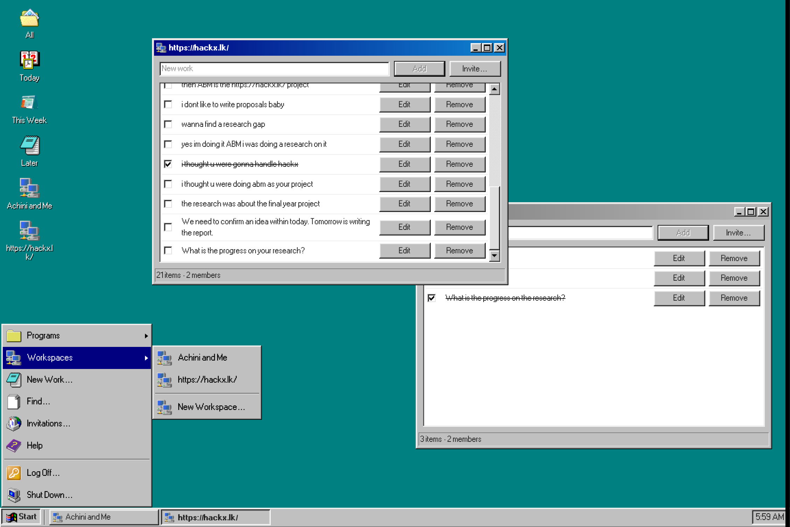

<!-- prettier-ignore -->
<div align="center">


# Kanban Board

[](https://nextjs.org)
[](https://www.typescriptlang.org)
[](https://convex.dev)
[](https://bun.sh)

A Windows 98-style kanban board. Sign in, open boards like desktop windows, and keep personal and shared work on a teal desktop with a Start menu and taskbar.

[Features](#features) • [Getting started](#getting-started) • [Usage](#usage) • [Project structure](#project-structure)



</div>

## Features

- **Windows 98 desktop** built with [98.css](https://jdan.github.io/98.css/) and [react-old-icons](https://www.npmjs.com/package/react-old-icons): boot screen, desktop icons, overlapping windows, Start menu, taskbar, minimize/maximize animations, and system sounds.
- **Personal boards** for **All**, **Today**, **This Week**, and **Later**. Drag works between board windows to reschedule them.
- **Shared workspaces** with owners and members. Create a workspace, invite people by email, accept invites from Inbox, rename or delete as the owner, or leave as a member.
- **Works** you can add, rename, mark done, search with Find, and delete.
- **Local cache** in IndexedDB via [Dexie](https://dexie.org). Board lists, workspace icons, and open windows come back on refresh. Convex stays the source of truth; edits still go through the backend.
- **Email and password auth** through [Convex Auth](https://labs.convex.dev/auth). Log Off signs you out. Shut Down powers off the desktop until you click to start again.

## Getting started

### Prerequisites

- [Bun](https://bun.sh) 1.3 or later
- A [Convex](https://convex.dev) account
- [Git](https://git-scm.com)

### Local setup

```bash
git clone https://github.com/ireallywantthatname/kanban-board.git
cd kanban-board
bun install
```

In one terminal, start Convex so it can create (or refresh) `.env.local`:

```bash
bunx convex dev
```

> [!NOTE]
> The first run opens a browser so you can log in to Convex and pick a deployment. That writes `NEXT_PUBLIC_CONVEX_URL` and `NEXT_PUBLIC_CONVEX_SITE_URL` into `.env.local`. Keep `bunx convex dev` running while you work. It pushes functions from `convex/` and keeps the backend in sync.

In a second terminal:

```bash
bun dev
```

Open [http://localhost:3000](http://localhost:3000). After the boot screen, create an account with email and password (at least 8 characters), then use the desktop as you would Windows 98.

> [!TIP]
> Use **New User...** on the logon dialog to register. After you sign in, double-click a desktop icon or use **Start → Programs** to open a board.

### Environment

| Variable | Where | Purpose |
| --- | --- | --- |
| `NEXT_PUBLIC_CONVEX_URL` | Next.js | Convex client URL |
| `NEXT_PUBLIC_CONVEX_SITE_URL` | Next.js | Convex HTTP / Auth site URL |
| `CONVEX_SITE_URL` | Convex | Auth provider domain (set by the Convex CLI) |

These are created by `bunx convex dev`. Do not commit `.env*` files.

## Usage

| Action | How |
| --- | --- |
| Open a board or workspace | Double-click its desktop icon, or use **Start → Programs** / **Start → Workspaces** |
| Move a personal work | Drag it from one board window onto another (**Today**, **This Week**, **Later**, **All**) |
| Add a work | Type in a board window and click **Add**, or use **Start → New Work...** |
| Search | **Start → Find...**, then open a match to jump to its board |
| Share a workspace | Right-click the workspace icon and choose **Invite...**, or click **Invite...** in the workspace window |
| Review invites | **Start → Invitations...**, or the **Inbox** icon when you have pending invites |
| Sign out | **Start → Log Off...** |
| Power off | **Start → Shut Down...**, then click the screen to boot again |

Workspace works stay on that workspace. They are not dragged between the personal time boards.

Refresh restores personal boards, workspace windows, Find, Help, and Invitations, including position and minimize state. Log Off, New Work, and delete/leave/rename/invite dialogs do not come back.

## Project structure

```text
src/
  app/                 Next.js app router (layout, home, icon)
  components/
    auth/              Logon / new-user dialog
    board/             Board and workspace windows
    desktop/           Shell: taskbar, Start menu, dialogs, boot/shutdown
    window/            Window manager, drag, focus, minimize
  lib/                 Boards, sounds, window ids, work drag, Dexie cache (`db.ts`, `persist.ts`)
  styles/98.css        98.css plus desktop chrome
convex/
  schema.ts            Works, workspaces, members, invites, auth tables
  works.ts             Personal and workspace works
  workspaces.ts        Create, rename, leave, delete, members
  invites.ts           Invite, accept, decline, revoke
  auth.ts              Password provider
public/                Fonts, Start icons, sounds, shutdown art
assets/screenshot.png  Desktop screenshot
```

The Next.js app is the desktop. Convex is the realtime backend: queries and mutations stay in sync across open windows and across people in the same workspace. Dexie holds a per-browser snapshot so a refresh does not flash empty lists or a blank desktop.

## Tech stack

- [Next.js](https://nextjs.org) 16 and [React](https://react.dev) 19
- [Convex](https://www.convex.dev) for the database, functions, and live updates
- [Convex Auth](https://labs.convex.dev/auth) with the password provider
- [Dexie](https://dexie.org) for IndexedDB cache and desktop session
- [OpenNext](https://opennext.js.org/cloudflare) on [Cloudflare Workers](https://developers.cloudflare.com/workers/)
- [98.css](https://jdan.github.io/98.css/) and [react-old-icons](https://www.npmjs.com/package/react-old-icons)
- [Tailwind CSS](https://tailwindcss.com) 4
- [Biome](https://biomejs.dev)
- [Bun](https://bun.sh)

## Scripts

```bash
bun dev            # Next.js dev server
bun run build      # Production build
bun start          # Serve the production build
bun lint           # Biome
bun run lint:fix   # Biome, apply safe fixes
bunx convex dev    # Convex backend (keep this running in development)
bun preview        # OpenNext Cloudflare preview
bun run deploy     # OpenNext build + Cloudflare Workers deploy (frontend only)
bun run upload     # OpenNext build + Cloudflare upload without activating
bun run cf-typegen # Wrangler types
```

The frontend ships to [Cloudflare Workers](https://developers.cloudflare.com/workers/) via OpenNext (`wrangler.jsonc`, domain `kanban.akashdesilva.space`). `bun run deploy` does **not** push Convex. Point the Worker's `NEXT_PUBLIC_CONVEX_URL` and `NEXT_PUBLIC_CONVEX_SITE_URL` at a Convex production deployment, and run `bunx convex deploy` for the backend.
